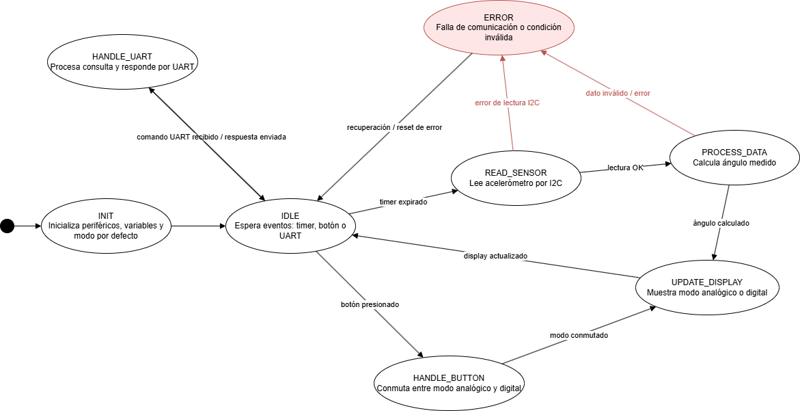

# Trabajo Práctico Final – Nivel Digital (Inclinómetro)

## Materia
Programación de Microcontroladores
Especialización en Sistemas Embebidos – FIUBA

## Alumno
Nombre: Ing. Nicolás Gabriel Rios Taurasi
Email: nicolas.rios.taurasi@gmail.com/nicoriostaurasi@frba.utn.edu.ar

## Docente
Nombre: Mg. Ing. Patricio Bos
Email: pbos@fi.uba.ar

## Ciclo lectivo
1er Bimestre - 2026

## Descripción

Inclinómetro digital (nivel) implementado sobre **STM32F446RE (Nucleo-64)**. El sistema lee la aceleración del eje X/Y/Z con un **ADXL345** por I2C, calcula los ángulos de **pitch** y **roll**, y los muestra en una pantalla **OLED SSD1306** en dos modos de visualización alternables:

- **DIGITAL:** valores numéricos de pitch y roll en texto.
- **ANALÓGICO:** visor circular tipo "burbuja" de nivel.

El cambio de modo puede hacerse con el **botón de usuario B1** de la Nucleo (antirrebote por FSM) o por **consola UART** (USART2 @ 115200 8N1). Un **parser de comandos** con FSM no bloqueante permite consultar el estado del sistema, leer ángulos/aceleraciones, alternar el modo de display y habilitar un loopback de UART.

La arquitectura es **cooperativa y no bloqueante**: todas las tareas corren como FSMs invocadas desde el `while(1)` de `main.c`, usando timers por software (`delay_t`) basados en `HAL_GetTick()`. La UART RX/TX se maneja por FIFO circular con interrupciones (`HAL_UART_*_IT`).

## Máquina de estados principal

La FSM principal (`APP_digitalAngleMeter`) orquesta la aplicación. Se invoca en cada iteración del super-loop y realiza un único paso por tick (no bloqueante):



**Estados:**

- `INIT` — Inicializa periféricos, variables y modo por defecto. Si algo falla → `ERROR`.
- `IDLE` — Espera eventos: timer de muestreo, botón o comando UART.
- `HANDLE_UART` — Procesa la consulta recibida (HELP, READ, STATUS, MODE, LOOPBACK) y responde por UART.
- `HANDLE_BUTTON` — Conmuta entre modo analógico y digital.
- `READ_SENSOR` — Lee el acelerómetro ADXL345 por I2C. Ante fallo de comunicación → `ERROR`.
- `PROCESS_DATA` — Calcula el ángulo medido (pitch / roll) a partir de la aceleración.
- `UPDATE_DISPLAY` — Muestra el ángulo en pantalla en el modo actual (analógico o digital).
- `ERROR` — Estado de falla de comunicación o condición inválida; intenta recuperación y vuelve a `IDLE`. El LED heartbeat parpadea más rápido (100 ms) como indicación visual.

## Hardware

- **MCU:** STM32F446RE (placa Nucleo-64)
- **Acelerómetro:** ADXL345 vía **I2C1** (dir `0x1D`, FULL_RES, ±2 g, 100 Hz)
- **Display:** OLED SSD1306 128×64 vía I2C
- **Botón:** B1 (onboard) para toggle de modo
- **LED:** LD2 (onboard) como heartbeat
- **UART:** USART2 (ST-Link VCP) @ 115200 8N1

## Arquitectura

El proyecto está organizado por capas, cada una en su propia carpeta con `Inc/` y `Src/`:

```
Nivel_Digital/
├── App/          → Lógica de aplicación (FSM orquestadora)
├── Services/     → Servicios de dominio (ángulo, pantalla, comandos, debounce)
├── Peripherals/  → Drivers de periféricos externos (ADXL345, SSD1306)
├── Bsp/          → Board Support Package (wrappers de HAL: GPIO, I2C, UART, delay)
├── Core/         → Código autogenerado por CubeMX (main, HAL config, ISRs)
└── Drivers/      → HAL y CMSIS de STMicroelectronics
```

### Capa `App/` – Aplicación

- `APP_digitalAngleMeter.[ch]` → FSM principal del inclinómetro. Secuencia: `INIT → IDLE → HANDLE_UART/HANDLE_BUTTON/READ_SENSOR → PROCESS_DATA → UPDATE_DISPLAY → ERROR_STATE`.

### Capa `Services/` – Servicios

- `SRV_accelerometer.[ch]` → Abstracción del acelerómetro: entrega lecturas en unidades de **g**.
- `SRV_angle.[ch]` → Conversión de aceleración a ángulos **pitch/roll** con filtrado por promedio móvil.
- `SRV_screen.[ch]` → Vistas de alto nivel: `screen_updateDigital()` y `screen_updateAnalog()`.
- `SRV_graphic.[ch]` → Primitivas de dibujo sobre framebuffer en RAM (pixel, línea, rectángulo, círculo, texto).
- `SRV_cmdParser.[ch]` → Parser de comandos UART con FSM no bloqueante + FIFO de salida.
- `SRV_debounce.[ch]` → FSM de antirrebote por software para el botón de usuario.

### Capa `Peripherals/` – Drivers

- `PER_adxl345.[ch]` → Driver del acelerómetro ADXL345 (registros, modos, lectura de ejes).
- `PER_ssd1306.[ch]` → Driver del display OLED SSD1306.
- `fonts.[ch]` → Tipografías de bitmap usadas por la capa gráfica.

### Capa `Bsp/` – Board Support Package

- `BSP_delay.[ch]` → Timers por software no bloqueantes (`delayInit/Read/Write/IsRunning`).
- `BSP_gpios.[ch]` → Wrappers de GPIO (botón, LEDs).
- `BSP_i2c.[ch]` → Wrapper del bus I2C.
- `BSP_uart.[ch]` → UART con TX/RX por FIFO circular e interrupciones.

### Capa `Core/` – Código de plataforma

- `main.c` → Inicializa HAL, configura clock y orquesta las FSMs en el super-loop.
- `stm32f4xx_it.c` → Vectores de interrupción.
- `stm32f4xx_hal_msp.c` → Configuración de bajo nivel de periféricos.

## Comandos UART

El parser acepta comandos **case-insensitive** terminados en `\r` o `\n`:

| Comando                    | Descripción                                    |
|----------------------------|------------------------------------------------|
| `HELP`                     | Lista los comandos disponibles                 |
| `READ ANGLE`               | Reporta pitch y roll actuales                  |
| `READ ACCELERATION`        | Reporta aceleración en g (X/Y/Z)               |
| `STATUS`                   | Estado de salud (sensor, display, UART)        |
| `MODE`                     | Consulta el modo de display actual             |
| `MODE TOGGLE`              | Alterna entre DIGITAL y ANALOG                 |
| `MODE DIGITAL`             | Fuerza modo DIGITAL                            |
| `MODE ANALOG`              | Fuerza modo ANALÓGICO                          |
| `LOOPBACK`                 | Consulta estado del loopback UART              |
| `LOOPBACK ON` / `OFF`      | Habilita / deshabilita loopback                |

## Herramientas

- STM32CubeIDE + HAL de STMicroelectronics
- Lenguaje C (C99)
- Git para control de versiones

---
